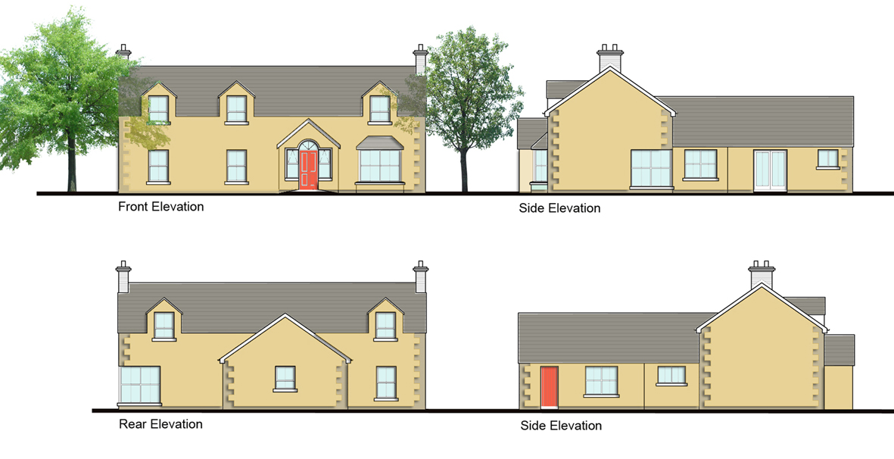

Proposed Dwelling  
Quarter Road  
Kirkistown  
Co. Down  

Elevations  

Proposed new dwelling designed to comply with strict Rural Planning Policies in an area between Kircubbin and Cloughey

Professional Services included, Planning Application, Building Control Package and Project Management.

