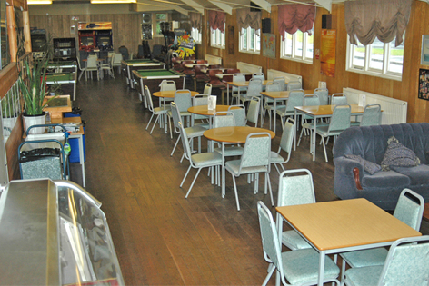
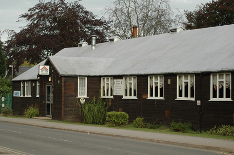
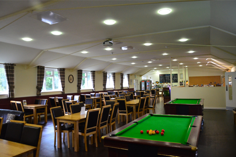
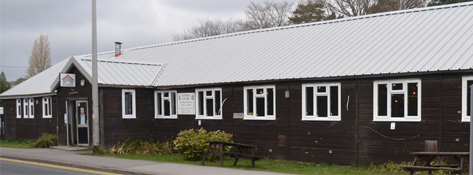
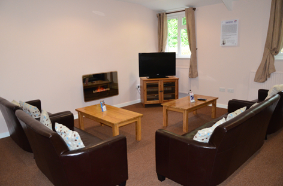

<h4 align="center">Sandes Pribright<h4> 

&nbsp;&nbsp;

<h4>Pre and During Construction</h4>

&nbsp;
 &nbsp;

<h4>Completed Project</h4>
<h4 align="center">£400K Refurbishment of Sandes, Pribright services include;
drawings, Bill of Quanties, contract documents and full project management</h4>
